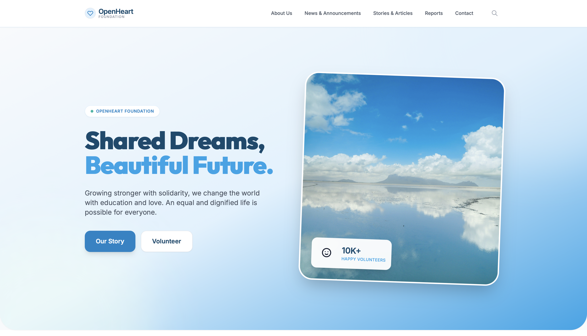

# OpenHeart Foundation - NGO Web Template

A modern, full-stack open-source web template designed for NGOs, charities, and non-profit organizations. It features a beautiful React frontend and a CMS (Strapi) backend for easy content management.




## 🚀 Features
- **Modern UI/UX:** Clean, responsive design suitable for reputable organizations.
- **Dynamic Content Management:** Built with [Strapi v4](https://strapi.io) for managing News, Articles, Reports, and the Homepage without coding.
- **Dockerized Setup:** Fully containerized for one-click local deployment.
- **Responsive Navigation:** Works perfectly on mobile, tablet, and desktop.

## 🛠 Tech Stack
- **Frontend:** React, TailwindCSS, TypeScript
- **Backend:** Strapi v4 (Headless CMS)
- **Database:** SQLite (Default) / Configurable for Postgres/MySQL

---

## 🏁 Getting Started

There are two ways to run this project: **Using Docker (Recommended)** or **Running Manually**.

### Method 1: Using Docker (Recommended for quick setup)

#### Prerequisites
- [Docker](https://www.docker.com/products/docker-desktop) and Docker Compose installed on your machine.

#### Step-by-step
1. **Start the containers**
   From the root of the project, run:
   ```bash
   docker compose up --build -d
   ```
2. **Access the application**
   - **Frontend (Website):** `http://localhost:3000`
   - **Backend (Strapi CMS):** `http://localhost:1337/admin`

*(If you make changes to the source code, simply restart the affected container or run the build command again.)*

---

### Method 2: Running Manually (For active development)

#### Prerequisites
- [Node.js](https://nodejs.org/) (Version 18 or 20 recommended)
- NPM (Usually comes with Node.js)

#### Step-by-step
1. **Install Frontend Dependencies:**
   ```bash
   npm install
   ```
2. **Install Backend Dependencies:**
   ```bash
   cd server
   npm install
   cd ..
   ```
3. **Start the Backend (Terminal 1):**
   ```bash
   cd server
   npm run develop
   ```
   *(Strapi will start at `http://localhost:1337/admin`)*

4. **Start the Frontend (Terminal 2):**
   ```bash
   npm start
   ```
   *(React will start at `http://localhost:3000`)*

---

## ⚙️ Initial Setup & Configuration

When you first launch the project, the CMS will be empty and the frontend might not display any data. Follow these steps to configure your site:

### 1. Create an Admin Account
Go to `http://localhost:1337/admin` and create your first administrator account.

### 2. Enable Public API Access (Crucial)
By default, Strapi restricts access to its APIs. To allow the frontend to fetch data:
1. In the Strapi Admin panel, go to **Settings** (bottom left).
2. Under "Users & Permissions Plugin", click on **Roles**.
3. Click on **Public**.
4. Scroll down to the **Permissions** section.
5. Open the dropdowns for `Article`, `Homepage`, `Message`, and `Report` (or any other required content type).
6. Check the **`find`** and **`findOne`** boxes for each.
7. Click **Save** in the top right corner.

### 3. Populate Content
- **Homepage:** Go to "Content Manager" > "Homepage", upload a `heroImage`, and save.
- **Articles & News:** Go to "Article", create new entries, and select categories (e.g., *Haberler*, *Duyurular*, *Basin*, *Makaleler*, *Hikayeler*).
- **Reports:** Go to "Report" and upload your PDFs.

*(Note: Ensure you click "Save" for Single Types and "Publish" for Collection Types if `draftAndPublish` is enabled, though it is disabled by default for some types in this project).*

---

## 🤝 Contributing
Contributions are welcome! Please feel free to submit a Pull Request.

## 📄 License
This project is open source and available under the [MIT License](LICENSE).
